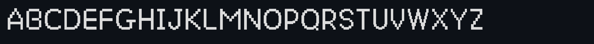

# Catwalk


Catwalk is a highly readable retro-themed font, available for anyone to use 💖 Make it yours,
keeping your feline aesthetic anywhere ✨ Catwalk Away...🐈

A pixel-styled font family with four styles: Regular, Bold, Italic, and Bold Italic.

Catwalk covers the Latin alphabet, digits, core punctuation, brackets, common symbols,
currency signs, fractions, math operators, and arrows.

🔗 **[Visit the Catwalk site](https://dawsmacs.github.io/Catwalk/)**

## Design Philosophy

- Pixel-first readability
- Consistent rendering across UI surfaces
- Retro aesthetic without sacrificing legibility
- Suitable for everyday device use

## Preview



## Installation

Copy the `.ttf` files into your system's font directory and refresh the font cache.

**🐧 Linux:**
```sh
cp *.ttf ~/.local/share/fonts/
fc-cache -f
```

**😈 BSD (FreeBSD, OpenBSD, NetBSD, etc.):**
```sh
mkdir -p ~/.local/share/fonts
cp *.ttf ~/.local/share/fonts/
fc-cache -f
```
For a system-wide install instead, copy into `/usr/local/share/fonts/`.

**🍎 macOS:** double-click each `.ttf` and choose "Install Font."

**🪟 Windows:** right-click each `.ttf` and choose "Install."

## License

Catwalk is released under the SIL Open Font License, Version 1.1. See [LICENSE](LICENSE)
for the full text.
